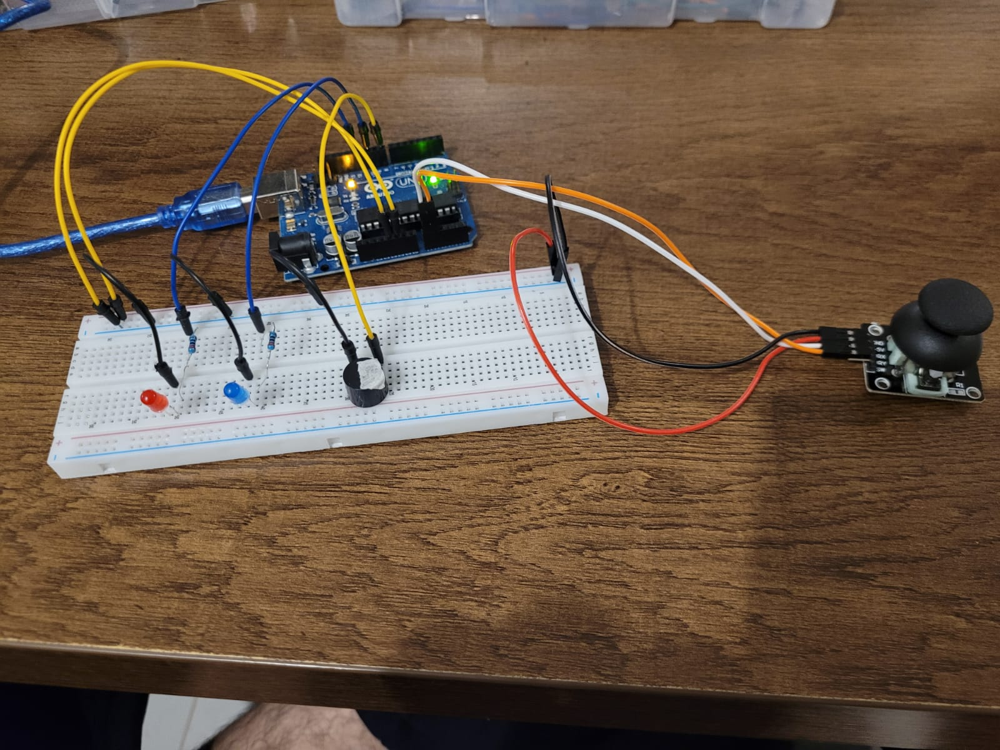
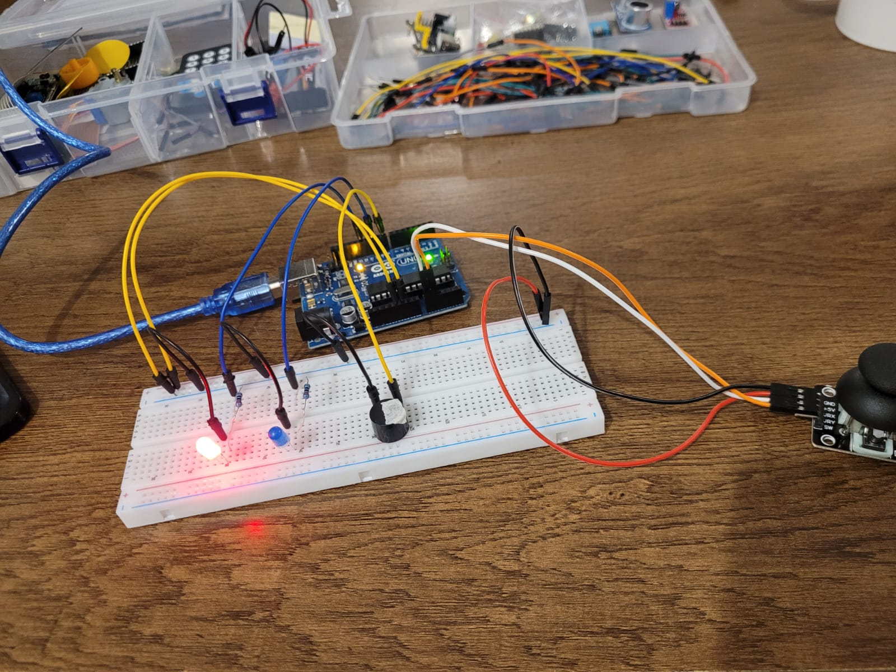
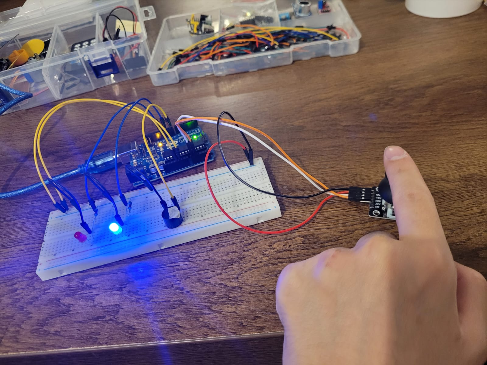

# Arduino-project-joyStick-directions

# Description:
This project is a pattern-based challenge using an Arduino, a joystick module, two LEDs (red and blue), and a buzzer.

The user must enter a specific sequence of joystick movements to "unlock" the system. Each joystick direction is assigned a number:

Up → 1

Right → 2

Down → 3

Left → 4


Example target pattern stored in the code:

Right, Right, Left, Left → which translates to: 2, 2, 4, 4

---

If the entered pattern is correct:

The blue LED turns ON

The buzzer plays a short success tone

The system indicates a successful unlock

---

If the pattern is incorrect:

The red LED turns ON

The buzzer plays an error tone

The system indicates failure

---

This project demonstrates how to use a joystick as an input method to create a pattern-recognition system. It’s perfect for practicing input sequencing, logic validation, and user feedback mechanisms using basic Arduino components.


# Pictures:





# Code Below:
```cpp
byte blueLED = 10;
byte redLED = 12;
byte buzzer = 8;

int pinX = A0;
int pinY = A1;

byte correctMoves[4] = {2,2,4,4};
byte moves[4];
byte currentLength = 0;
int Xread, Yread;
byte count = 0;

bool state = true;


void setup() {
  Serial.begin(9600);
  pinMode(redLED, OUTPUT);
  pinMode(blueLED, OUTPUT);
  pinMode(buzzer, OUTPUT);
}

void loop() {
  Xread = analogRead(pinX);
  Yread = analogRead(pinY);

  if (count < 4){
    if (Xread > 750){
      moves[count] = 2;
      count++;
      delay(700);
      }

    if (Xread < 300){
      moves[count] = 4;
      count++;
      delay(700);
      }

    if (Yread > 750){
      moves[count] = 1;
      count++;
      delay(700);
      }

    if (Yread < 300){
      moves[count] = 3;
      count++;
      delay(700);
      }

    }


  else{
    for (byte i=0; i<4; i++){
      if (moves[i] != correctMoves[i]){
        state = false;
      }
    }

    if (state){
      digitalWrite(blueLED, HIGH);
      digitalWrite(buzzer, HIGH);
      delay(1500);
      digitalWrite(blueLED, LOW);
      digitalWrite(buzzer, LOW);
    }

    else{
      for (byte time=0; time<2; time++){
        digitalWrite(redLED, HIGH);
        digitalWrite(buzzer, HIGH);
        delay(300);
        digitalWrite(redLED, LOW);
        digitalWrite(buzzer, LOW);
        delay(500);
      }
    }

    count = 0;

    state = true;

    for (byte i=0; i<4; i++){
      moves[i] = 0;
    }
  }

}
```
